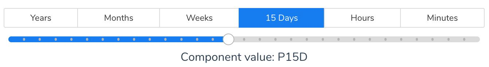

# Description

Simple Vue component that allows selection of time based interval and returns its ISO value (to be used in psql queries, as an example). The component is based on Buefy library.



## Example

```javascript
<template>
  <div id="app">
    <IntervalSlider v-model="isointerval" :intervals="intervals"></IntervalSlider>
    <p>Component value: {{isointerval}}</p>
  </div>
</template>

<script>
import IntervalSlider from "./components/IntervalSlider";
export default {
  name: "App",
  data() {
    return {
      isointerval: null,
      intervals: [
        { label: "Years", prefix: "P", suffix: "Y", min: 1, max: 10 },
        { label: "Months", prefix: "P", suffix: "M", min: 1, max: 12 },
        { label: "Weeks", prefix: "P", suffix: "W", min: 1, max: 52 },
        { label: "Days", prefix: "P", suffix: "D", min: 1, max: 31 },
        { label: "Hours", prefix: "PT", suffix: "H", min: 1, max: 23 },
        { label: "Minutes", prefix: "PT", suffix: "M", min: 15, max: 59 }
      ]
    }
  },
  components: {
    IntervalSlider
  }
};
</script>

<style>
#app {
  font-family: "Nunito", Helvetica, Arial, sans-serif;
  -webkit-font-smoothing: antialiased;
  -moz-osx-font-smoothing: grayscale;
  text-align: center;
  color: #2c3e50;
  margin-top: 60px;
}
</style>

```
